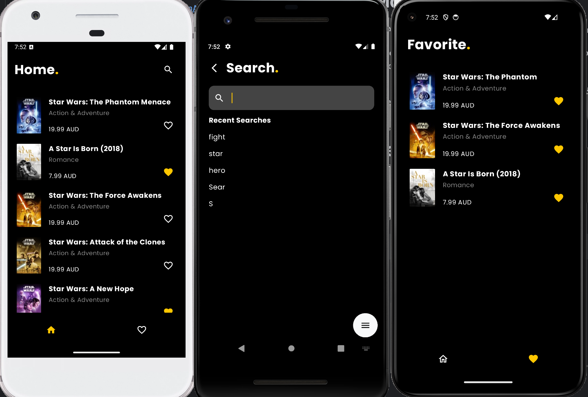

# Movie app
An Android demo app built with Flutter.

# Feature

**Home screen**
- Display list of movie
- Favorite/ Unfavorite a movie
- Pull to refresh the movie list
- Load more movies when scrolling to the end of the list

**Search screen**
- Search movies based on input query
- Show recent search queries

**Favorite screen**
- Display list of favorite movies
- Swipe to remove a movie from the favorite list

**Detail screen**
- Show a movie detail 

Project structure inspired from [Compass app](https://github.com/flutter/samples/tree/main/compass_app)

# Architecture
- [MVVM (Model-View-ViewModel)](https://docs.flutter.dev/app-architecture/guide#mvvm) architecture pattern, which helps separate concerns and makes the codebase easier to test and maintain
- [Provider](https://pub.dev/packages/provider) for state management and dependency injection

# Persistence
- [sqflite](https://pub.dev/packages/sqflite): persist structured data `Movie`, save and remove favorite movie in Favorite Screen,
  make it possible to show the favorite list even when the app has no connection
- [shared_preferences](https://pub.dev/packages/shared_preferences): save recent search queries to display on the Search screen
